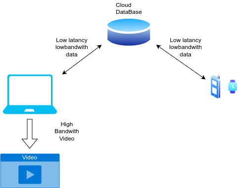

# MinimalIRLStream
MinimalIRLStream is a way to IRL Stream with less mobile data. lowbandwith data such as heartrate,oxygen level,stepcount and position is sent from your phone and wearables to a cloud database from which a server or desktop composes that data into a video stream, this saves bandwith and is ideal for Outdoors activities Streams where high speed internet is not available.

